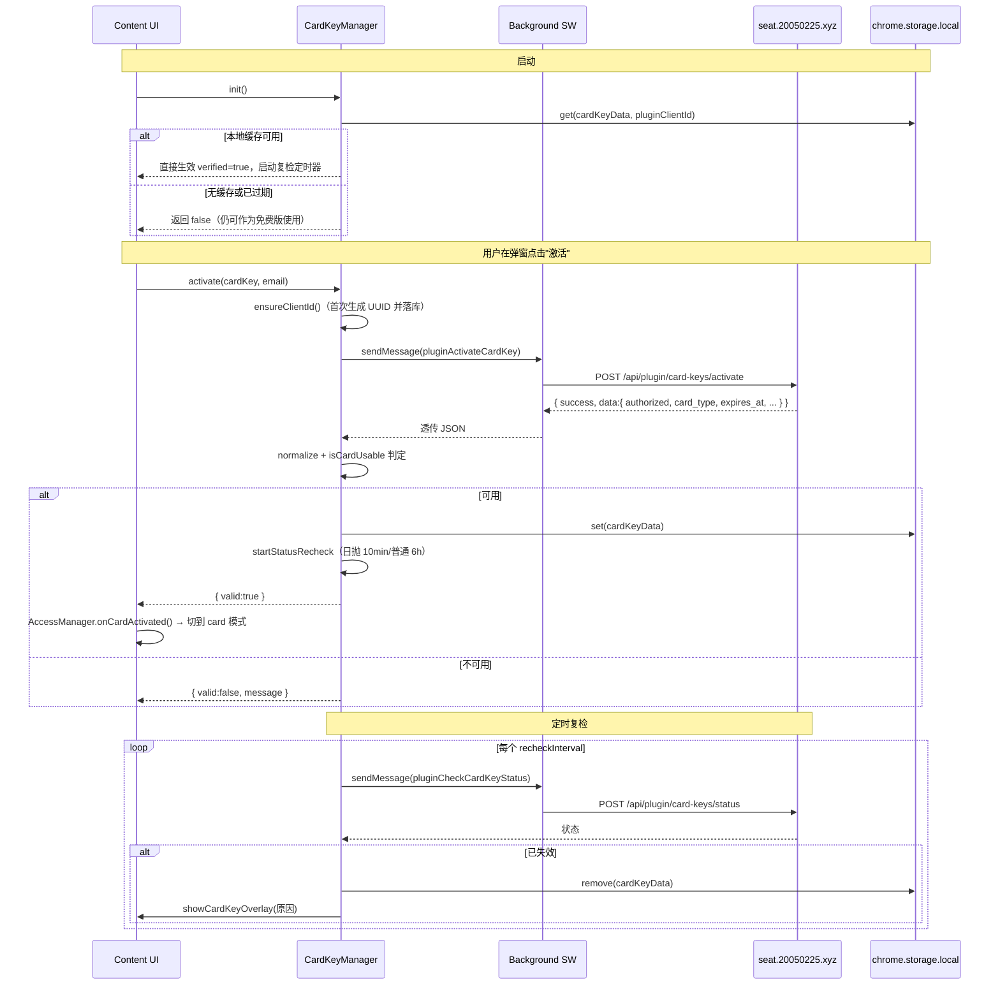

# ChatGPT 对话保存助手 - 项目概览

## 一、项目是做什么的

这是一个 **Chrome Manifest V3 浏览器扩展**（项目内部代号 `chat-massage`，对外名 `ChatGPT 对话保存助手`，当前版本 `2.0.1`），核心作用是：

> 在 `chatgpt.com` / `chat.openai.com` 页面上**自动捕获 ChatGPT 对话**，并把内容、附件、生成文件一键导出到用户本地选定的文件夹。

主要能力：


| 能力        | 说明                                                               |
| --------- | ---------------------------------------------------------------- |
| 多格式导出     | 支持 **HTML / Markdown / PDF / JSON** 四种格式同步保存                     |
| 自动保存      | 通过 `MutationObserver` + URL 监听，对话有变化时自动保存（防抖 2s）                 |
| 资产同步      | 抓取并保存 `uploads/`（用户上传）、`generated/`（GPT 生成）、`context/`（上下文 JSON） |
| 上下文延续     | 把保存过的对话作为上下文重新喂回 ChatGPT 继续对话                                    |
| 模型用量统计    | 跟踪 GPT-5/Pro/Thinking 等模型的请求量与配额窗口                               |
| 卡密激活      | 通过远程卡密区分 **免费版**（有配额）和 **付费版**（无限）                               |
| PDF v2 引擎 | 自研的结构化 PDF 渲染管线（AST → renderer → Worker）                         |


技术栈：

- 纯原生 JS（CommonJS / 浏览器 IIFE），没有上层框架
- `esbuild` 打包 PDF v2 Worker
- `vitest` + `jsdom` 跑单元测试
- 第三方库：`marked`、`dompurify`、`turndown` + `gfm 插件`、`html2canvas`、`jspdf`、`@react-pdf/renderer`

---

## 二、目录结构（核心部分）

```
chat-massage/
├── manifest.json              MV3 清单：注入脚本、host_permissions、service worker
├── package.json               依赖与脚本（test / build:pdf-v2）
├── src/
│   ├── background/
│   │   └── background.js      Service Worker：消息路由、卡密 API 转发、配置缓存定时刷新
│   ├── content/
│   │   ├── content.js         ★ 主逻辑（约 4000 行）：CardKeyManager、UI、自动保存、UsageMonitor…
│   │   ├── fetchInterceptor.js  在 MAIN world 拦截 ChatGPT 的 fetch，捕获文件/对话事件
│   │   ├── observer.js        URL & DOM 监听
│   │   └── parser.js          DOM → 消息结构体
│   ├── popup/                 浏览器图标弹窗（仅用于授权目录、勾选格式、立即导出）
│   ├── help/                  使用说明页（guide.html）
│   ├── lib/                   第三方库的浏览器版（turndown / marked / purify / html2canvas / jspdf）
│   ├── pdf-v2/                自研 PDF 渲染管线（AST + renderers + Worker bridge）
│   ├── workers/               PDF 渲染 Worker
│   └── utils/
│       ├── accessManager.js          ★ 访问模式（card / free）状态机
│       ├── featureQuotaManager.js    ★ 免费版功能配额限制
│       ├── clientConfigCache.js      远程公告/升级配置的本地缓存
│       ├── exporter.js               导出主入口（编排 html/md/pdf/json）
│       ├── htmlExporter.js / mdExporter.js / pdfExporter.js / jsonExporter.js
│       ├── fileSystem.js             File System Access API 封装（目录授权、写入）
│       ├── conversationAssets.js     uploads / generated / context 资产采集
│       ├── templateManager.js        自定义提示模板（免费版限 2 个）
│       ├── searchIndex.js / selectionManager.js / tokenEstimator.js / aboutRenderer.js
├── tests/                     vitest 单元测试
├── scripts/
│   ├── build-pdf-v2.mjs       esbuild 构建 PDF Worker
│   └── test-client-config-api.mjs  ★ 验证远程客户端配置接口
└── docs/
    ├── privacy-policy.md      隐私政策（说明哪些数据会上传）
    └── chrome-web-store-submission.md  上架商店时的说明
```

---

## 三、卡密验证逻辑（重点）

整个授权体系由 **三层** 协同：

```
┌──────────────────────┐   ┌────────────────────┐   ┌────────────────────────┐
│  CardKeyManager      │ → │  AccessManager     │ → │  FeatureQuotaManager   │
│  与远程服务对接的卡密 │   │  对外呈现的访问模式 │   │  免费版的配额限制       │
│  状态机              │   │  card / free       │   │  导出 20 次/模板 2 个等 │
└──────────────────────┘   └────────────────────┘   └────────────────────────┘
```

> 项目允许 **不激活卡密也能用**（免费模式有额度限制）。卡密激活后直接进入 **无限模式**。

### 1. 后端服务

所有卡密接口都打到固定域名 `https://seat.20050225.xyz`，由 `manifest.json` 的 `host_permissions` 显式声明：

```15:15:f:/chat-massage/manifest.json
    "https://seat.20050225.xyz/api/plugin/card-keys/*"
```

四个端点：


| 路径                                        | 用途               |
| ----------------------------------------- | ---------------- |
| `POST /api/plugin/card-keys/activate`     | 首次激活并绑定设备        |
| `POST /api/plugin/card-keys/status`       | 周期性复检卡密状态        |
| `POST /api/plugin/card-keys/rebind`       | 换绑设备             |
| `GET /api/plugin/card-keys/client-config` | 拉取公告/升级配置（与卡密无关） |


请求 body 统一：

```json
{ "card_key": "xxx", "email": "xxx@example.com", "client_id": "uuid" }
```

### 2. 请求路径：Content Script → Background → 服务

为了规避 CORS，Content Script **不直接** 发请求，而是 `chrome.runtime.sendMessage` 转给 Service Worker：

```207:227:f:/chat-massage/src/background/background.js
async function handlePluginCardKeyRequest(path, request, sendResponse) {
  try {
    const resp = await fetch(BASE_API_URL + path, {
      method: 'POST',
      headers: { 'Content-Type': 'application/json' },
      body: JSON.stringify({
        card_key: request.card_key,
        email: request.email,
        client_id: request.client_id
      })
    });
    const json = await resp.json();
    sendResponse(json);
  } catch (e) {
    sendResponse({
      success: false,
      message: '网络错误: ' + e.message,
      data: { authorized: false }
    });
  }
}
```

Background 中按 `request.action` 把三个动作映射到不同 path：

```162:172:f:/chat-massage/src/background/background.js
      case 'pluginActivateCardKey':
        await handlePluginCardKeyRequest('/api/plugin/card-keys/activate', request, sendResponse);
        break;

      case 'pluginCheckCardKeyStatus':
        await handlePluginCardKeyRequest('/api/plugin/card-keys/status', request, sendResponse);
        break;

      case 'pluginRebindCardKey':
        await handlePluginCardKeyRequest('/api/plugin/card-keys/rebind', request, sendResponse);
        break;
```

### 3. CardKeyManager 状态机（src/content/content.js）

源码位置：`src/content/content.js` 第 91~370 行。

**关键状态字段：**

```91:99:f:/chat-massage/src/content/content.js
  const CardKeyManager = {
    verified: false,
    cardData: null,
    clientId: null,
    clientIdStorageKey: 'pluginClientId',
    defaultRecheckInterval: 6 * 60 * 60 * 1000, // 默认每6小时重新校验一次
    daypassRecheckInterval: 10 * 60 * 1000, // 日抛卡10分钟复检
    recheckInterval: 6 * 60 * 60 * 1000,
    recheckTimer: null,
```

**关键方法：**


| 方法                          | 作用                                                     |
| --------------------------- | ------------------------------------------------------ |
| `init()`                    | 启动时从 `chrome.storage.local` 读 `cardKeyData`，本地判可用就直接生效 |
| `ensureClientId()`          | 第一次生成 `crypto.randomUUID()`，落库 `pluginClientId`        |
| `activate(cardKey, email)`  | 调 `pluginActivateCardKey`                              |
| `verify(cardKey, email)`    | 等价于 `activate`                                         |
| `checkStatus(...)`          | 调 `pluginCheckCardKeyStatus`，失效时清空本地数据                 |
| `rebind(cardKey, email)`    | 调 `pluginRebindCardKey`                                |
| `requestAndApplyCardData()` | 统一入口：发请求 + 规范化数据 + 落库 + 重启复检                           |
| `isCardUsable(data)`        | 判定卡是否仍可用（无限 / 到期检测）                                    |
| `canUseNow()`               | 给外部用的"现在能不能用"判断（带自动清理）                                 |
| `startStatusRecheck()`      | 起一个 `setInterval`，日抛卡 10 分钟一次，普通卡 6 小时一次               |
| `clearCardData()`           | 清状态 + 停定时器 + 通知 AccessManager + 刷新 UI                  |


**三种卡类型：**

- `daypass`（日抛卡）：有到期时间，按小时显示剩余，10 分钟复检一次
- `unlimited`（无限卡）：无到期，只看 `authorized`
- 其它（时长卡）：按到期日 + `remaining_days` 显示

**核心可用性判定：**

```316:327:f:/chat-massage/src/content/content.js
    isCardUsable(cardData) {
      if (!cardData) return false;
      if (this.isUnlimited(cardData)) {
        return cardData.authorized !== false;
      }

      if (cardData.authorized !== true) return false;

      const expiryTs = this.getExpiryTimestamp(cardData);
      if (expiryTs === null) return false;
      return expiryTs > Date.now();
    },
```

**激活流程（成功路径）：**

```155:189:f:/chat-massage/src/content/content.js
    async requestAndApplyCardData({ action, cardKey, email, clearOnInvalid = false }) {
      const normalizedCardKey = String(cardKey || '').trim();
      const normalizedEmail = String(email || '').trim();
      if (!normalizedCardKey || !normalizedEmail) {
        return { valid: false, message: '请填写卡密和邮箱' };
      }

      try {
        const clientId = await this.ensureClientId();
        const json = await this.sendRuntimeMessage(action, {
          card_key: normalizedCardKey,
          email: normalizedEmail,
          client_id: clientId
        });

        const normalized = this.normalizeCardData(json?.data, normalizedCardKey, normalizedEmail, clientId);
        if (json?.success && this.isCardUsable(normalized)) {
          this.verified = true;
          this.cardData = normalized;
          await this.persistCardData(normalized);
          this.startStatusRecheck();
          return { valid: true, data: normalized, message: json?.message || '' };
        }

        if (clearOnInvalid) {
          await this.clearCardData();
          if (typeof UI !== 'undefined' && UI.updateCardKeyBadge) {
            UI.updateCardKeyBadge();
          }
        }
        return { valid: false, message: json?.message || '卡密校验失败' };
      } catch (e) {
        return { valid: false, message: '网络错误，无法验证卡密' };
      }
    },
```

### 4. AccessManager 访问模式（src/utils/accessManager.js）

只有两种模式：`card`（无限） / `free`（有额度限制）。逻辑非常简单：

```18:40:f:/chat-massage/src/utils/accessManager.js
  async init(cardKeyManager) {
    this._cardKeyManager = cardKeyManager || null;
    const loadedMode = await this._loadMode();
    this._state.accessMode = loadedMode;

    let cardValid = false;
    if (this._cardKeyManager?.init) {
      try {
        cardValid = await this._cardKeyManager.init();
      } catch (e) {
        cardValid = false;
      }
    }

    if (cardValid && this._cardKeyManager?.canUseNow?.()) {
      this._state.accessMode = 'card';
    } else {
      this._state.accessMode = 'free';
    }

    await this._saveMode();
    return true;
  },
```

`canUseNow()` 在源码里直接 **永远返回 true**——也就是说**不阻止操作**，只是顺带把当前模式同步成 `card` 或 `free`：

```64:71:f:/chat-massage/src/utils/accessManager.js
  canUseNow() {
    if (this._cardKeyManager?.canUseNow?.()) {
      this._state.accessMode = 'card';
    } else {
      this._state.accessMode = 'free';
    }
    return true;
  },
```

历史上的"游客试用"逻辑已被废弃（保留空函数仅为兼容旧 UI）。

### 5. FeatureQuotaManager 免费版配额（src/utils/featureQuotaManager.js）

只在 `AccessManager.getAccessMode() === 'free'` 时生效，否则全部"无限"放行：

```11:18:f:/chat-massage/src/utils/featureQuotaManager.js
const FeatureQuotaManager = {
  STORAGE_KEY: 'featureQuotaStateV1',
  LIMITS: {
    export: { md: 20, pdf: 20 },
    monthly: { continuation: 30, navigation: 500 },
    templateCustom: 2
  },
```


| 配额项         | 限额    | 周期             |
| ----------- | ----- | -------------- |
| Markdown 导出 | 20 次  | **永久总额**（用完即停） |
| PDF 导出      | 20 次  | **永久总额**       |
| 延续对话        | 30 次  | **每自然月**       |
| 导航跳转        | 500 次 | **每自然月**       |
| 自定义模板       | 2 个   | 总量             |


月度配额到月初自动归零（`_ensureCurrentMonthlyPeriod`）。`canUse / consume` 两段式：先判余量再扣减。

### 6. UI 入口（src/content/content.js）

`UI.showCardKeyOverlay(message)` 渲染一个全屏遮罩，含**卡密 + 邮箱**双输入框、**🔑 验证激活** 与 **🔄 换绑设备** 两个按钮（约 1833~1984 行）。流程：

1. 表单校验 → `CardKeyManager.activate / rebind`
2. 成功 → `AccessManager.onCardActivated()` → 更新顶部徽章 → 刷新配额指示 → 调 `initAfterCardKey()` 完成后续初始化
3. 失败 → 红字回显错误（日抛过期会被特殊文案改写）

顶部徽章 `updateCardKeyBadge()` 根据卡型展示：

- 免费版 → `🆓 免费版`
- 无限版 → `🔑 无限版`
- 日抛 → `🕒 日抛 剩余 N 小时/天`（≤24h 红字）
- 时长卡 → `🔑 剩余 N 天`

### 7. 持久化 Key


| storage.local key                     | 用途                                                                                     |
| ------------------------------------- | -------------------------------------------------------------------------------------- |
| `pluginClientId`                      | 当前设备的客户端 ID（UUID）                                                                      |
| `cardKeyData`                         | 整张卡的完整状态缓存（含 `card_key`/`email`/`expires_at`/`card_type`/`authorized`/`lastCheckTime`） |
| `accessModeV2` / `accessMode`（legacy） | 当前访问模式                                                                                 |
| `featureQuotaStateV1`                 | 免费版各配额已用次数                                                                             |
| `pluginClientConfigCacheV1`           | 远程公告配置缓存（6 小时刷新一次）                                                                     |


### 8. 卡密验证完整时序




### 9. 隐私边界（重要）

来自 `docs/privacy-policy.md` 和 `docs/chrome-web-store-submission.md`：

- **会发到 `seat.20050225.xyz`**：仅 `card_key` / `email` / `client_id`
- **不会发到第三方**：ChatGPT 对话正文、导出的文件内容、上传/生成文件的文件内容、本地目录路径

---

## 四、其它值得知道的点

- **PDF v2** 走结构化 AST → renderer → Worker 渲染管线（`src/pdf-v2/` + `src/workers/pdfRender.worker.mjs`）；遇到对话过长会自动切多份 PDF
- **fetchInterceptor.js** 注入到 MAIN world，监听 ChatGPT 的 `fetch` 调用，捕获文件/会话事件
- **UsageMonitor** 通过解析工作空间名 + 接口响应，识别 free/plus/pro/team/enterprise 套餐，并按模型 ID 维护请求时间窗
- 顶层 `chatgpt_sandbox_downloader (1).js`、`cishu.js`、`chatgpt-saver.user.js`、`extension.crx/pem`、`chatgpt-saver-extension.zip` 是历史构建产物或油猴版兼容产物，不参与 MV3 扩展运行时

